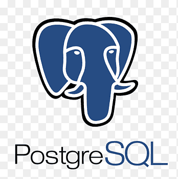
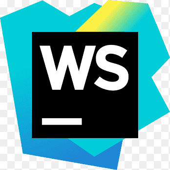
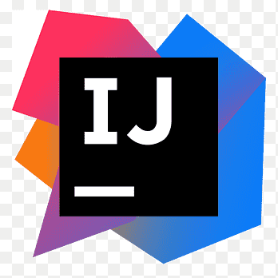

## Hi :wave:, I'm Juan Camilo

A passionate backend developer from Colombia :colombia: . with a taste for problem solving, learning, algorithms and coffee :coffee: .

### Contact me
* [LinkedIn](https://www.linkedin.com/in/juan-camilo-arrieta-bernal-b05766165/?originalSubdomain=co)
* [arrietacamilo530@gmail.com](#)

### Languages and tools
My tools to create software are :technologist:.

 

